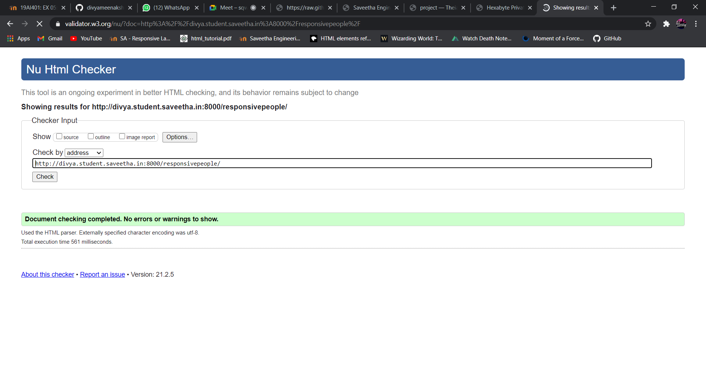

# Design of Responsive Website
## AIM:
To design a responsive website with two break points.

## DESIGN STEPS:
### Step 1: 
Requirement collection.
### Step 2:
Creating the layout using HTML and CSS.
### Step 3:
Updating the sample content.
### Step 4:
Choose the appropriate style and color scheme.
### Step 5:
Validate the layout in various browsers.
### Step 6:
Validate the HTML code.
### Step 7:
Create a database model and migrate the database.
### Step 8:
Retrieve data from database and display it in a dynamic webpage.
### Step 9:
Publish the website in the given URL.

## PROGRAM:
### responsivebase.html
```

<!doctype html>
<html lang="en">
  <head>
    <!-- Required meta tags -->
    <meta charset="utf-8">
    <meta name="viewport" content="width=device-width, initial-scale=1, shrink-to-fit=no">

    <!-- Bootstrap CSS -->
    <link rel="stylesheet" href="https://maxcdn.bootstrapcdn.com/bootstrap/4.0.0/css/bootstrap.min.css" integrity="sha384-Gn5384xqQ1aoWXA+058RXPxPg6fy4IWvTNh0E263XmFcJlSAwiGgFAW/dAiS6JXm" crossorigin="anonymous">

    <title>Hexabyte Private Limited</title>
  </head>
  <body>
    <div class="jumbotron">
        <div class="container text-center">
            <h1 class="display-3">Hexabyte Private Limited</h1>
            <p class="lead">We manufacture high qualilty electronic products</p>
        </div>
    </div>
    <div class="container">
        <div class="row text-center">
            <div class="col-12 col-md-3"><a href="/responsivehome">Home</a></div>
            <div class="col-12 col-md-3"><a href="/responsiveproduct">Product</a></div>
            <div class="col-12 col-md-3"><a href="/responsivepeople">People</a></div>
            <div class="col-12 col-md-3"><a href="/responsivecontactus">Contact us</a></div>
        </div>
    </div>
    <div class="container">
        
    
    </div>
    <div class="container">
        <div class="row align-items-end">
            <div class="col text-center">
                Copyright © 2021 Hexabyte Private Limited, Developed by Divya
            </div>
        </div>
    </div>
    <!-- Optional JavaScript -->
    <!-- jQuery first, then Popper.js, then Bootstrap JS -->
    <script src="https://code.jquery.com/jquery-3.2.1.slim.min.js" integrity="sha384-KJ3o2DKtIkvYIK3UENzmM7KCkRr/rE9/Qpg6aAZGJwFDMVNA/GpGFF93hXpG5KkN" crossorigin="anonymous"></script>
    <script src="https://cdnjs.cloudflare.com/ajax/libs/popper.js/1.12.9/umd/popper.min.js" integrity="sha384-ApNbgh9B+Y1QKtv3Rn7W3mgPxhU9K/ScQsAP7hUibX39j7fakFPskvXusvfa0b4Q" crossorigin="anonymous"></script>
    <script src="https://maxcdn.bootstrapcdn.com/bootstrap/4.0.0/js/bootstrap.min.js" integrity="sha384-JZR6Spejh4U02d8jOt6vLEHfe/JQGiRRSQQxSfFWpi1MquVdAyjUar5+76PVCmYl" crossorigin="anonymous"></script>
  </body>
</html>
```

### responsivehome.html
```



<div class="card">
  
  <div class="card-body">
    <h5 class="card-title">About Us</h5>
    <p class="card-text">Hexabyte Private Limited, provides a broad range of semiconductor and infrastructure software applications that serve the data center, networking, software, broadband, wireless, and storage and industrial markets. Common applications for its products include: data center networking, home connectivity, broadband access, telecommunications equipment, smartphones, base stations, data center servers and storage, factory automation, power generation and alternative energy systems, displays, and mainframe operations and management, and application software development. Some of Silicon's core technologies and products include:
    <ul>
        <li>Memory Chips</li>
        <li>SATA HDD</li>
        <li>SATA SSD </li>
        <li>Broadband Modems</li>
        <li>Wifi Devices</li>
        <li>Switching Devices</li>
        <li>Optical Sensors</li>
    </ul> 
  </div>
</div>

```

### responsivepeople.html
```



<div class="row text-center">
    <div class="col-12">
        <p class="lead">Executive Officer's</p>
    </div>
</div>
    <div class='row text-center'>
        <div class="card col-12 col-md-6 col-lg-4">
            <div class="card">
                
            </div>
            <div class="card p-3 text-right">
                <blockquote class="blockquote mb-0">
                    <p>Steve Jobs</p>
                    <footer class="blockquote-footer">
                        <small class="text-muted">
                            <b>President</b> <cite title="Source Title">of a company</cite>
                        </small>
                    </footer>
                </blockquote>
            </div>
        </div>
        <div class="card col-12 col-md-6 col-lg-4">
            <div class="card">
                
            </div>
            <div class="card p-3 text-right">
                <blockquote class="blockquote mb-0">
                    <p>Tim Berners Lee</p>
                    <footer class="blockquote-footer">
                        <small class="text-muted">
                            <b>Cheif Executive Officer</b> <cite title="Source Title">of a company</cite>
                        </small>
                    </footer>
                </blockquote>
            </div>
        </div>
        <div class="card col-12 col-md-6 col-lg-4">
            <div class="card">
                
            </div>
            <div class="card p-3 text-right">
                <blockquote class="blockquote mb-0">
                    <p>Ted codd</p>
                    <footer class="blockquote-footer">
                        <small class="text-muted">
                            <b>Cheif Operating Officer</b> <cite title="Source Title">of a company</cite>
                        </small>
                    </footer>
                </blockquote>
            </div>
        </div>
        <div class="card col-12 col-md-6 col-lg-4">
            <div class="card">
                
            </div>
            <div class="card p-3 text-right">
                <blockquote class="blockquote mb-0">
                    <p>Mark Zukerberg</p>
                    <footer class="blockquote-footer">
                        <small class="text-muted">
                            <b>Cheif Financial Officer</b> <cite title="Source Title">of a company</cite>
                        </small>
                    </footer>
                </blockquote>
            </div>
        </div>
        <div class="card col-12 col-md-6 col-lg-4">
            <div class="card">
                
            </div>
            <div class="card p-3 text-right">
                <blockquote class="blockquote mb-0">
                    <p>Arthur C Clarke</p>
                    <footer class="blockquote-footer">
                        <small class="text-muted">
                            <b>Cheif Legal Officer</b> <cite title="Source Title">of a company</cite>
                        </small>
                    </footer>
                </blockquote>
            </div>
        </div>
        <div class="card col-12 col-md-6 col-lg-4">
            <div class="card">
                
            </div>
            <div class="card p-3 text-right">
                <blockquote class="blockquote mb-0">
                    <p>James Goslings</p>
                    <footer class="blockquote-footer">
                        <small class="text-muted">
                           <b>Cheif Marketing Officer</b><cite title="Source Title">of a company</cite>
                        </small>
                    </footer>
                </blockquote>
            </div>
        </div>
    </div>
    
```
### responsiveproduct.html
```



<div class="row text-center">
    <div class="col-12">
        <p class="lead">Our Premium Products</p>
    </div>
  
</div>
<div class="row text-center">
    <div class="card col-12 col-md-6 col-lg-3">
    
    <div class="card-body">
        <h5 class="card-title"><b> Samsung EVO plus</b></h5>
        <p class="card-text">(Samsung 32GB Evo Plus )<br>Price: Rs.600.00</p>
    </div>
    </div>
    <div class="card col-12 col-md-6 col-lg-3">
    
    <div class="card-body">
        <h5 class="card-title"><b>SanDisk ultra 32 gb</b></h5>
        <p class="card-text">(SanDisk Ultra 32 GB MicroSDHC Class 10 98 MB/s Memory )<br> Price: Rs.900.00</p>
    </div>
    </div>
    <div class="card col-12 col-md-6 col-lg-3">
    
    <div class="card-body">
        <h5 class="card-title"><b>Intel® Core™2 Duo Processor E7500</b></h5>
        <p class="card-text">(Duo E8400 )<br>Price: Rs.475.00</p>
    </div>
    </div>
    <div class="card col-12 col-md-6 col-lg-3">
    
    <div class="card-body">
        <h5 class="card-title"><b>Intel CL8064701528404S R195</b></h5>
        <p class="card-text">(Microprocessor MPU Core™ i7-4860EQ Processor RISC 64bit 22nm 1.8GHz 1364-Pin FCBGA)<br>Price: Rs.5500.00</p>
    </div>
    </div>
    <div class="card col-12 col-md-6 col-lg-3">
    
    <div class="card-body">
        <h5 class="card-title">Supermicro Tesla K80 Graphic Card<b></b></h5>
        <p class="card-text"> (2 GPUs - 562 MHz Core - 875 MHz Boost Clock - 24 GB GDDR5 SDRAM)<br>Price: Rs.5000.00</p>
    </div>
    </div>
    <div class="card col-12 col-md-6 col-lg-3">
    
    <div class="card-body">
        <h5 class="card-title"><b>ANDTRONICS PCI VGA </b></h5>
        <p class="card-text">(Add on Card 8MB with ATI chip)<br>Price: Rs.2.500.00</p>
    </div>
    </div>
    <div class="card col-12 col-md-6 col-lg-3">
    
    <div class="card-body">
        <h5 class="card-title"><b>ON Semiconductor </b></h5>
        <p class="card-text">(NCS2200AGEVB)<br>Price: Rs.2,200.00</p>
    </div>
    </div>
    <div class="card col-12 col-md-6 col-lg-3">
    
    <div class="card-body">
        <h5 class="card-title"><b>Win10 MINI PC Stick Computer</b></h5>
        <p class="card-text"> (Intel Atom Z8350 + 4 GB Ram ))<br>Price: Rs.3,500.00</p>
    </div>
    </div>
    <div class="card col-12 col-md-6 col-lg-3">
    
    <div class="card-body">
        <h5 class="card-title"><b>TDA7388 4 Channel Power Audio Amplifier IC</b></h5>
        <p class="card-text"> (1 x TDA7388 4 Channel Power Audio Amplifier IC)<br>Price: Rs.5,099.00</p>
    </div>
    </div>
    <div class="card col-12 col-md-6 col-lg-3">
    
    <div class="card-body">
        <h5 class="card-title"><b>Car audio power amplifier </b></h5>
        <p class="card-text"> (IC chips Support BOM)<br>Price: Rs.2,399.00</p>
    </div>
    </div>
    <div class="card col-12 col-md-6 col-lg-3">
    
    <div class="card-body">
        <h5 class="card-title"><b>SparkFun  LED Lighting Development Tools</b></h5>
        <p class="card-text"> (BOB-10680)<br>Price: Rs.2,199.00</p>
    </div>
    </div>
    <div class="card col-12 col-md-6 col-lg-3">
    
    <div class="card-body">
        <h5 class="card-title"><b>24-Channel  LED Driver</b></h5>
        <p class="card-text"> (12-bit PWM)<br>Price: Rs.39,999.00</p>
    </div>
    </div>
</div>

```

### responsivecontactus.html
```



<div class="card">
  
  <div class="card-body">
    <div class="card-title"><h5 class="col text-center">Contact Us</h5></div>
    <p class="card-text">
        <hr>
        <div class="col text-center">
        <h4 class="lead">Email:  hexabytepvt.ltd@gmail.com</h4><br>
        <h4 class="lead">Phone: +822 34440105</h4><br>
        <h4 class="lead">Address:  42 Teheran-ro 108-gil, Daechi-dong,Gangnam-gu, Seoul, South Korea</h4>
        </div>
        <hr>
  </div>
</div>

```


## OUTPUT:
### Laptop View


### Mobile View


### Ipad View


### Validate report





## RESULT:
Thus a website is designed for the responsive website with two break points and is hosted in the URL http://divya.student.saveetha.in:8000/. HTML code is validated.